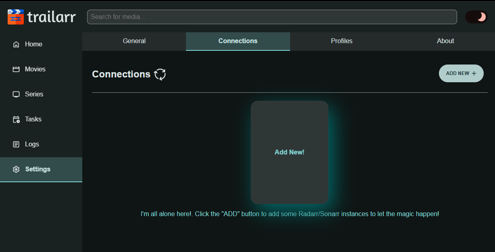
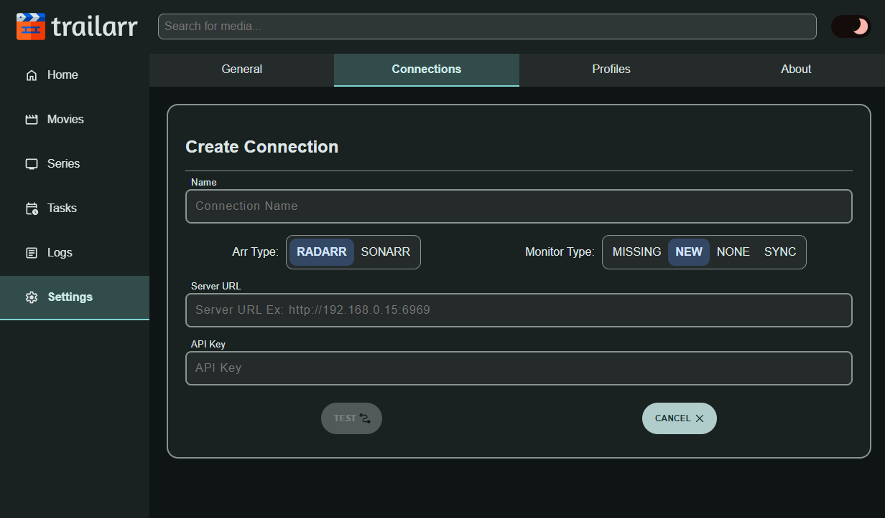
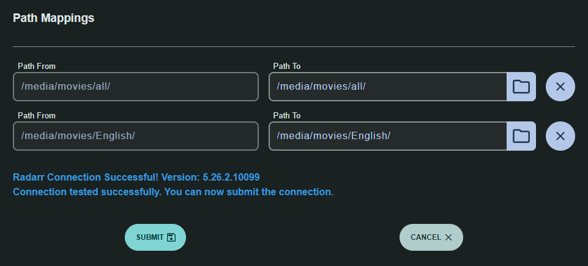

# Connections

Once your Profiles are set up to your liking, it's time to add your Radarr and Sonarr connections. This allows Trailarr to communicate with your *Arr instances, discover your media, and manage trailers.



Setting up a connection involves three main steps:

## 1. **Connection Details**

- Navigate to `Settings > Connections`.
- Click on `Add New` button.

- Fill in the basic details for your *Arr instance (e.g., Radarr or Sonarr):
    - **Name:** A friendly name for this connection (e.g., "Main Radarr", "4K Sonarr", or simply "Radarr").
      I am adding a `Radarr` connection, so I named it `Radarr`
    - **Arr Type:** Select Radarr or Sonarr.
      It's already set to `Radarr` by default, so I didn't change it.
    - **Monitor Type:** Choose which Media items Trailarr needs to monitor from this connection.
    - **Server URL:** The full URL of your *Arr instance. Eg: `http://192.168.0.15:6969`
        
        !!! warning "Do NOT use `localhost`"
            Do not use `localhost` as there are numerous problems with that and it might not always work!

            Instead use a static IP address
      
    - **API Key:** Your API key from Radarr/Sonarr (found in its `Settings > General` section).
- Once these details are filled in, the `Test` button will become available, click the button.
- Trailarr will attempt to connect to the *Arr API. Upon a successful connection:
    - The Arr API version will be displayed.
    - Trailarr will automatically fetch the root folders configured in that *Arr instance.

!!! warning ""
    If the connection fails, an error will be shown with details, correct them and click `Test` again!

## 2. **Path Mappings**

After a successful initial test, Trailarr needs to know how to access the media files managed by this *Arr instance. This is where you map the root folders reported by the *Arr API to the paths where Trailarr can find them.

!!! tip ""
    Remeber the `Volume Mappings` we set during [installation](../02-installation/docker-compose.md#explanation-of-options), we use them here!


- For each root folder retrieved from the *Arr instance, you'll see a "Path From" and a "Path To" field.
    - **Path From (read only):** This is the root folder path as known by your *Arr instance (e.g., `/movies` or `/tv`). This field is usually read-only.
    - **Path To:** This is where you tell Trailarr to find the *contents* of that "Path From" folder *within Trailarr's own file system (i.e., inside its Docker container)*.
    
    !!! tip ""
        Use the 📁 icon next to the text input field for `Path To`, a dialog will open showing files and folders *inside Trailarr container*, navigate to the folder for the `Path To` and click `Confirm`.
    
    !!! danger ""
        You can `Delete` a `Path Mapping` by clicking on the `X` button next to it!

          - You can remove it if your `Path From` is same as `Path To`.
          - You can leave them there even if `Path From = Path To`.
    
    We have some examples (the same ones from `Docker Compose`):

    ??? example "Examples 1 & 2 - TRaSH Guides - SAME path as `Radarr`/`Sonarr`"
        If you used a `volume mapping` that is SAME as `Radarr`/`Sonarr` in `Trailarr` then `Path To` is same as `Path To`:

        ```yaml hl_lines="7 14"
        services:
          radarr:
            image: ghcr.io/hotio/radarr:latest
            # Other options here
            volumes:
            - /docker/appdata/radarr:/config
            - /data:/data
            # Other options here
          trailarr:
            image: nandyalu/trailarr:latest
            # Other options here
            volumes:
            - /docker/appdata/trailarr:/config
            - /data:/data
            # Other options here
        ```
        OR

        ```yaml hl_lines="7 14"
        services:
          radarr:
            image: ghcr.io/hotio/radarr:latest
            # Other options here
            volumes:
              - /docker/appdata/radarr:/config
              - /mnt/movies_disk/media/movies:/media/movies
            # Other options here
          trailarr:
            image: nandyalu/trailarr:latest
            # Other options here
            volumes:
              - /docker/appdata/trailarr:/config
              - /mnt/series_disk/media/tv:/media/tv
            # Other options here
        ```
        The folder dialog might already in the folder you are looking for, just press `Confirm`!
    
    ??? example "Example 3 - DIFFERENT path than `Radarr`/`Sonarr`"
        If you used a `volume mapping` which is DIFFERENT than what you had in `Radarr`/`Sonarr`, meaning - we changed the actual location of where the media files are present, so we need to tell `Trailarr` where to find them:

        ```yaml hl_lines="5 9 13-14"
        # USE THIS INSTEAD
        radarr:
          # other config
          volumes:
            - /mnt/disk1/media/movies:/data
        sonarr:
          # other config
          volumes:
            - /mnt/disk2/media/tv:/data
        trailarr:
          # other config
          volumes:
            - /mnt/disk1/media/movies:/data/movies # <-- MODIFIED
            - /mnt/disk2/media/tv:/data/tv # <-- MODIFIED
        ```

        - The root folder for `Radarr` connection is `/data/movies` or under that folder!
        - The root folder for `Sonarr` connection is `/data/tv` or under that folder!

        Navigate to the folder and press `Confirm`!

        So, when Trailarr gets a Movie folder path it will use the `Path Mapping` to convert it like this

        ```yaml
        Radarr Media Path: '/data/The Matrix (1999)'
        Trailarr Media Path: '/data/movies/The Matrix (1999)'
        ```

        Trailarr knows where to find it, so all will work as expected!

    ??? example "Example 4 - Windows users"

        We used `volume mappings` like this for `Trailarr`:

        ```yaml hl_lines="6-9"
        services:
          trailarr:
            # Other options here
            volumes:
              - trailarr_data:/config # Docker volume for appdata, the first part `trailarr_data` is the volume name
              - M:\Movies:/m/movies   # Movies drive
              - R:\TV:/r/tv           # TV series drive 1
              - S:\TV:/s/tv           # TV series drive 2
              - T:\TV:/t/tv           # TV series drive 3
            restart: unless-stopped

        volumes:
          trailarr_data:  # volume name, should match the volume name in the service
            # Any extra options for the volume if needed
        ```

        - The root folder for `Radarr` connection is `/m/movies` or under that folder!
        - The root folders for `Sonarr` connection are:
            - `/r/tv`
            - `/s/tv`
            - `/t/tv`

        Navigate to the appropriate folder and press `Confirm`!
    
    ??? example "Example 5 - Non-Docker `Radarr`/`Sonarr`"
        Since `Radarr` and `Sonarr` are Non-Docker installations, we don't have any `volume mappings` for them, so we created some, now we need to tell `Trailarr` where to find them!

        If we used something like this

        ```yaml hl_lines="6"
        services:
          trailarr:
            # Other options here
            volumes:
              - /docker/appdata/trailarr:/config # appdata
              - /mnt/disk1/movies:/media/movies # Movies Folder
              - /mnt/disk2/tv:/media/tv # TV Folder
            restart: unless-stopped
            # Other options here
        ```

        - The root folder for `Radarr` connection is `/media/movies` or under that folder!
        - The root folder for `Sonarr` connection is `/media/tv` or under that folder!

        Navigate to the folder and press `Confirm`! 

        So, when Trailarr gets a Movie folder path it will use the `Path Mapping` to convert it like this

        ```yaml
        Radarr Media Path: '/mnt/disk1/movies/The Matrix (1999)'
        Trailarr Media Path: '/media/movies/The Matrix (1999)'
        ```
        
        Trailarr knows where to find it, so all will work as expected!

Once all Path Mappings are filled out, you should have something like below, you can move on to next step!


!!! tip ""
    Crucially, ensure that each "Path From" is correctly mapped to its corresponding location in Trailarr's file system.

## 3. **Validate & Submit**

- Once you have updated the "Path To" for all root folders, the `Test` button will become enabled again.
- Click this button. Trailarr will now attempt to validate these path mappings by checking if it can access them.
- The server will return a result indicating success or failure.

    

- If all mappings are validated successfully, the `Test` button will change to `Submit`, click it to save the connection.

You have now successfully added an *Arr connection! Trailarr will begin to sync media information from this instance. 🥳🎉

You can repeat the same steps for other `Radarr`/`Sonarr` connections you want `Trailarr` to monitor!

We are almost done with the seup, just read some information and tips we put together for you in [Next Steps](../04-next-steps.md).