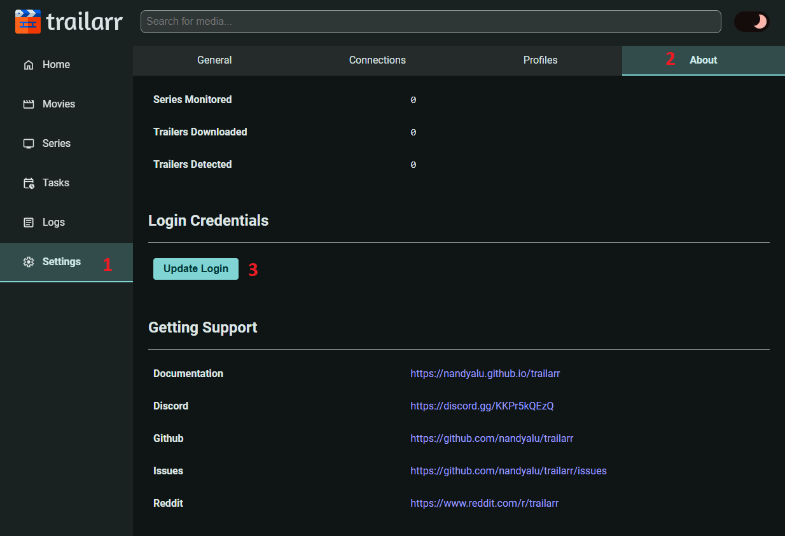

# Setup

Once Trailarr is installed and running, it's time to perform the initial configuration. 

This guide will walk you through the steps to set up your Trailarr instance, including changing the default login credentials and adjusting general settings. We'll also cover how to set up your media library connections in the next sections.

1.  **Access Trailarr:**
    Open your web browser and navigate to Trailarr. If you installed it on the same machine you're using, this will typically be `http://localhost:7889` (or whichever host port you mapped during installation).

2.  **Initial Login:**
    You will be greeted with a login screen.
    *   Default Username: `admin`
    *   Default Password: `trailarr`
    Enter these credentials and click `Login`.

3.  **Change Login Credentials:** (Optional but recommended)
    For security, it's highly recommended to change the default username and password immediately.

    

    *   Navigate to `Settings` in the sidebar.
    *   Go to the `About` tab within Settings.
    *   Click the `Update Login` button.
    *   A dialog will appear allowing you to set a new username and/or a new password.

        !!! tip 
            You can leave the username/password blank if you only want to change one of them.
        
    *   Enter your desired new credentials and click `Save`. You may be logged out and asked to log in again with your new credentials.

4.  **Update General Settings:**
    After updating your login, review and adjust other application settings.
    *   Navigate to `Settings` in the sidebar, unless you are already in the `Settings` section.
    *   Go to the `General` tab.
    *   Here you can configure various options according to your preferences. Review each setting carefully.
    *   Some of the settings are auto-saved as you make selections. The settings that doesn't auto-save will show a button next to them, prompting to `Save`.

With these initial configuration steps completed, you're ready to move on to setting up [Profiles](./profiles.md) and [Connections](./connections.md).
