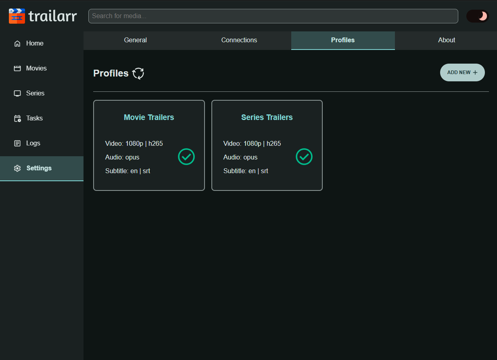

# Profiles

Once the basic Trailarr configuration is done, it's time to look at **Profiles**.

Profiles define the settings for trailers (like quality, format, search, etc.) and include filters that determine when each profile will be applied to your media.

!!! example ""
    *For example, you might want different trailer settings for movies than for TV series, or different settings for animated movies compared to live-action ones.*

!!! tip ""
    `Profiles` allow you to play with different settings and filters that allow you to customize Trailarr and make it download a different language trailer for certain media, or 4K trailers for some movies, etc. So, we won't cover them here and instead just use the default Profiles for now. You can play with them later.

    More details on Profiles are under [User Guide > Profiles](../../user-guide/settings/profiles/index.md)

Trailarr comes with two default profiles to get you started:

1.  **Movies:** A pre-configured profile tailored for movies.
2.  **Series:** A pre-configured profile tailored for TV series.

You can:

*   **Use the default profiles:** For many users, the default profiles will work well out-of-the-box.
*   **Edit the default profiles:** Navigate to `Settings > Profiles`, select a profile, and click on it to open it where you can customize its settings and filters.
*   **Create new profiles:** If you have more specific needs, you can create entirely new profiles from scratch by clicking the `Add New` button in `Settings > Profiles`.

Review the default profiles and consider if they meet your needs. If not, adjust them or create new ones before proceeding to set up your connections.

!!! tip 
    Make sure the Profiles are enabled, disabled Profiles will not be used!

More information regarding `Profiles` can be found in [User Guides > Profiles](../../user-guide/settings/profiles/index.md).

You are now ready to setup [Connections](./connections.md) to Radarr/Sonarr to let Trailarr start working on your trailers.
